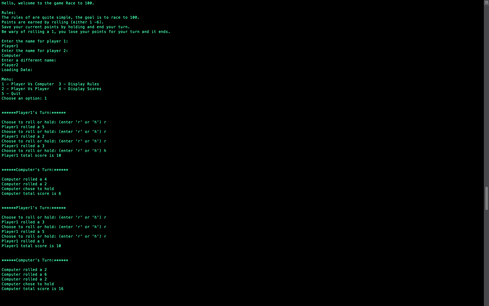

# Race-To-100
Race to 100 game
- A quick game to 100 where a player rolls a dice and either gains points or looses points if a 1 is rolled
- Implemented PvP and computer mode
- Improvements:
  The data is stored in vectors and stores information in text files. 
  The data should be stored in lists, sturcts, or other more efficient data structures than vectors.

Start Up:

Finish:

